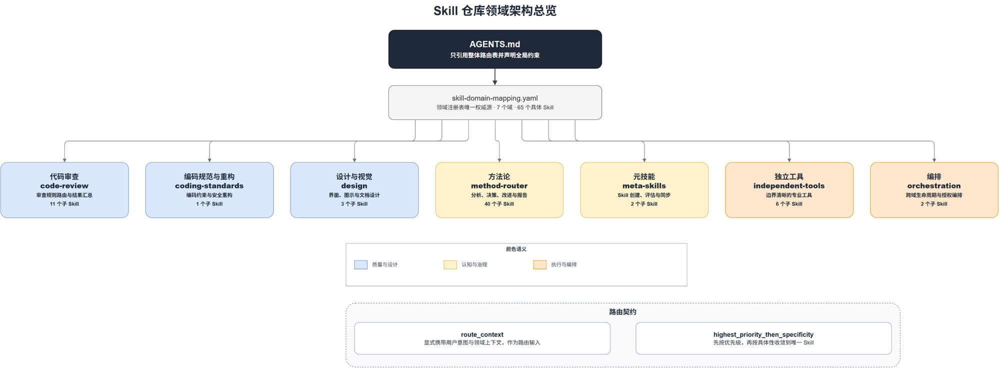
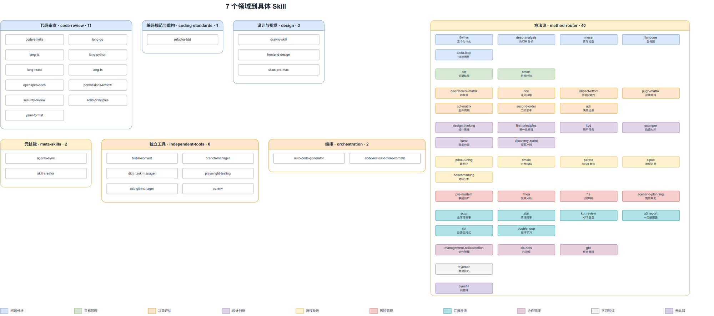

# Skills Repository

本仓库维护可复用的 Agent Skill、领域路由和跨客户端同步能力。仓库采用
`AGENTS.md -> skill-domain-mapping.yaml -> 领域 Skill -> 具体 Skill` 的分层结构。

## AGENTS.md 的职责

根目录 `AGENTS.md` 只保存通用约束，例如 TDD、代码审查、Git 安全、输出语言和平台约定。
它会由 `agents-sync` 同步到 Codex、Claude Code 和 OpenCode，因此不承载本仓库专属的领域清单、
目录说明或维护手册。

本仓库专属说明由本 README 维护；领域、Skill 名称、描述和物理路径的唯一注册源是
`skill-domain-mapping.yaml`。

## 路由结构

| 领域 | 目录 | 职责 |
|------|------|------|
| 代码审查 | `code-review/` | 按语言和风险路由审查规则 |
| 编码规范与重构 | `coding-standards/` | 通用编码约束和安全重构 |
| 设计与视觉 | `design/` | UI/UX、前端视觉和图示设计 |
| 方法论 | `method-router/` | 分析、决策、改进和报告方法 |
| 元技能 | `meta-skills/` | Skill 创建、评估和同步 |
| 独立工具 | `independent-tools/` | 边界清晰的专业工具 |
| 编排 | `orchestration/` | 跨领域生命周期与提交编排 |

根注册表负责领域、规范 `skill_name`、描述和仓库相对路径。领域映射只负责将领域内意图映射到
规范 `skill_name`，不重复保存物理路径。父 Skill 读取领域映射后，再通过根注册表解析实际路径。

当前根注册表包含 7 个领域、65 个注册 Skill；其中 `method-router` 注册 40 个方法论 Skill。
`method-router/references/method-mapping.yaml` 是意图路由的权威配置，负责分类、上下文和路由链，
不应以 README 或父 Skill 中的静态清单替代。

### 方法论路由契约

方法论路由使用 `route_context` 描述候选上下文，字段包括 `type`、`urgency`、`domain`、
`has_data`、`complexity`、`sub_type`、`scope` 和 `cynefin_pre`。匹配策略为
`highest_priority_then_specificity`：先选优先级最高的候选，再以条件具体度（匹配条件数量）
打破同优先级冲突；仍无法唯一确定时询问用户，未命中则执行该类型的 fallback（当前为展示
Top 3 并等待选择），不猜测默认 Skill。

完全初始或几乎没有上下文的任务由 Discovery Sprint 处理：先联网调研公开实践和反例，明确
“事实 / 推断 / 假设”，再进行结构化头脑风暴，最终收敛为探索简报和首个可验证实验。探索结束
后按已明确的问题类型重新路由，不自动获得实施授权。

根注册表只登记本仓库内的 Skill。包含 `:` 的限定名称（例如 `visualize:visualize`）属于平台或
插件提供的外部 Skill，由客户端的平台 Skill 注册表解析；领域映射必须显式标记
`resolution: platform_skill_registry`，不得为外部 Skill 伪造本仓物理路径。

## 目录约定

```text
AGENTS.md                       通用且可同步的 Agent 约束
README.md                       本仓库说明
skill-domain-mapping.yaml       全仓领域与 Skill 注册表
skill-domain-architecture.drawio 可编辑的领域总览
<domain>/SKILL.md               领域入口和路由算法
<domain>/references/*mapping.yaml 领域内意图映射
<domain>/<skill>/SKILL.md       具体 Skill
```

## 新增或移动 Skill

1. 将 Skill 放入职责匹配的领域目录，确保 `SKILL.md` 包含 `name` 和 `description`。
2. 更新 `skill-domain-mapping.yaml` 中的规范名称、描述和仓库相对路径。
3. 只有领域意图发生变化时，才更新该领域的意图映射；领域映射只引用 `skill_name`。
4. 运行仓库路由契约测试并使用 `agents-sync` 同步三套客户端入口。
5. 不修改 `AGENTS.md`，除非通用 Agent 约束本身发生变化。

## 跨客户端同步

`meta-skills/agents-sync` 为 Codex、Claude Code 和 OpenCode 创建一级领域 Junction。具体 Skill
通过父域目录树发现，不创建顶层叶子别名。同步器同时把 `skill-domain-mapping.yaml` 以文件链接
暴露到三个消费者的 skills 根目录，使父域可解析仓库内 Skill 路径。同步流程不会删除普通目录；
发生冲突时先停止并要求人工处理。

## 架构图

可编辑源文件：`skill-domain-architecture.drawio`





预览图由 draw.io CLI 从源文件导出：

```powershell
& "D:\Program Files\draw.io\draw.io.exe" -x -f png --width 2000 --page-index 1 -o skill-domain-architecture.png skill-domain-architecture.drawio
& "D:\Program Files\draw.io\draw.io.exe" -x -f png --width 2000 --page-index 2 -o skill-domain-architecture-skills.png skill-domain-architecture.drawio
```

## 验证

```powershell
python -m unittest tests.test_skill_repository_layout tests.test_additional_skill_domains
python -m unittest tests.test_method_router_contract
python -m unittest discover -s design\tests -p "test_*.py"
python -m unittest discover -s orchestration\auto-code-generator\tests -p "test_auto_code_generator.py"
```
