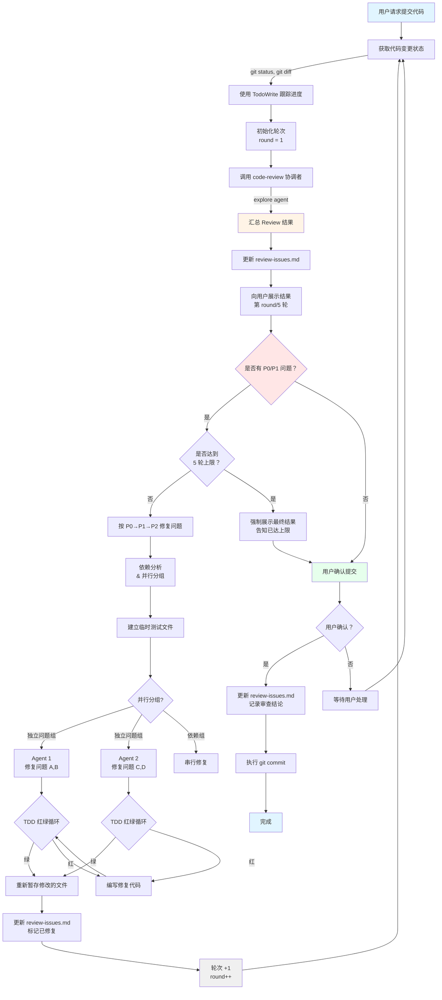

# Code Review Before Commit

## 触发条件

用户请求提交代码 (commit) 时自动触发。

## 审查依据

本工作流的审查标准来自 `code-review` 技能:

- **审查规则**: 根据变更文件自动路由到 `code-review/` 下对应子 skill
- **问题记录**: 统一使用 `code-review/review-issues.md`
- **优先级规则**: 见 `code-review/SKILL.md` 的"分类审查"章节
- **审查输出**: 遵循 `code-review/SKILL.md` 定义的格式

本技能专注于:
- 提交前自动化流程控制
- 5 轮修复循环机制
- 用户确认和 git commit 执行

## 执行流程



## 循环机制

- **最大循环次数**: 5 轮
- **轮次计数**: 使用 TodoWrite 跟踪当前轮次 (第 1/5 轮，第 2/5 轮...)
- **每轮流程**: GetStatus → StartReview → 发现问题 → 规划路径 → TDD红绿 → 修复 → 轮次 +1 → GetStatus (重新审查)
- **结束条件**: Review 通过 (P0/P1 问题已修复) 或达到最大循环次数

### 每轮执行步骤

1. **获取代码变更状态**
   - 执行 `git status` 查看所有未提交的文件
   - 执行 `git diff --cached` 查看已暂存的变更
   - 执行 `git diff` 查看未暂存的变更
   - 使用 TodoWrite 跟踪审查进度和当前轮次

2. **启动 Code Review**
   - 调用 `code-review` 协调者技能 (自动路由到子 skills)
   - 审查本次提交的代码
   - 传递当前轮次信息 (如：第 2/5 轮)
   - 重点检查：架构一致性、测试覆盖、代码风格
   - **注意**: 非首轮时，agent 会自然发现上一轮问题是否已修复
   - **关键**: 不暂存 `review-issues.md`，审查记录不提交到 git

3. **汇总 Review 结果**
   - 将 review 结果整理后呈现给用户
   - 使用表格总结检查项
   - 显示当前轮次 (第 X/5 轮)
   - 按优先级分组 (P0/P1/P2)
   - **必须更新 `review-issues.md` 记录所有发现的问题**

4. **问题修复** (如有 P0/P1 问题且未达上限)
    a. **规划修复路径 & 分组并行策略**
       - 分析每个问题的根因和影响范围
       - 按 P0→P1→P2 排序修复顺序
       - **依赖分析**: 识别问题之间的文件/逻辑依赖关系
       - **并行分组**: 无依赖关系且影响不同文件的问题分组并行修复
       - **串行依赖链**: 有依赖关系的问题保持串行修复
       - 明确修复范围，避免过度修改

    b. **建立临时测试文件**
       - 为每个待修复问题创建独立的临时测试文件
       - 测试先写"失败"状态（红）
       - 测试应覆盖问题的核心场景和边界情况

    c. **多 Agent 并行修复**
       - **分组执行**: 对每个并行组，启动多个 parallel agent 同时修复
       - 每个 agent 负责一组独立问题，互不干扰
       - 每个 agent 内部执行 TDD 红绿循环:
         - 运行测试确认失败（红）
         - 编写最小修复代码（绿）
         - 验证修复代码不引入回归
       - **依赖组**: 有依赖的问题组串行执行（先完成的前置组）

    d. **汇总变更 & 清理**
       - 汇总各 agent 的变更到暂存区
       - 清理临时测试文件
       - 更新 `review-issues.md` 中标记已修复

    e. **轮次推进**
       - 轮次 +1，回到步骤 1 重新审查

### 并行修复策略

**并行分组规则:**

| 条件 | 策略 | 说明 |
|------|------|------|
| 不同文件、无逻辑依赖 | 并行 | 可同时修复 |
| 同一文件、不同函数 | 串行 | 避免合并冲突 |
| 有依赖关系 (如接口+实现) | 先修接口组，再实现组 | 按依赖链排序 |
| P0 + 独立 P1/P2 | 先 P0 串行，再 P1/P2 并行 | P0 必须优先修复 |

**执行方式:**

```
依赖分析 → 分组 [独立组A, 独立组B, ...] → 并行执行 [AgentA, AgentB, ...] → 汇总
```

- 使用并发工具调用启动多个 parallel agent 并行修复
- 每个 agent 接收明确的任务描述和文件范围
- 各 agent 互不干扰，各自执行 TDD 红绿循环
- 全部完成后汇总变更到暂存区

5. **用户确认** (Review 通过后或已达上限)
   - 说明变更内容，询问确认
   - 提交信息需要先展示给用户确认
   - 用户确认后，执行实际的 git commit 操作
   - 更新 `code-review/review-issues.md` 中的审查结论

## 提交注意事项

- **绝对不要** 将 `review-issues.md` 加入暂存或提交
- 执行 commit 前确保 `review-issues.md` 未被 `git add`
- 审查记录是开发过程文件，不纳入 git 历史

## 问题记录

**必须**在每轮 review 后更新问题记录文件:

```
<project-root>/.opencode/skills/code-review/review-issues.md
```

问题记录格式详见 `code-review/SKILL.md` 的"问题记录格式"章节。

## 铁律速查

| 规则 | 内容 | 违反后果 |
|------|------|:------:|
| R0 | 未经用户确认不得直接提交代码 | 提交被拒绝，必须重新走完整流程 |
| R1 | 每一轮必须执行完整 review，不得跳过 | 未经验证的代码可能包含安全漏洞或 bug |
| R2 | 不得修改用户未同意的代码 | 引入非预期变更，难以回溯 |
| R3 | P0/P1 问题未清零不得提交 | 阻塞性问题遗留到生产环境 |
| R4 | 每轮 review 后必须更新 `review-issues.md` | 问题跟踪链断裂，重复审查无效 |
| R5 | `review-issues.md` 不得加入暂存或提交 | 审查记录污染 git 历史 |

## 实战反例

| Agent 可能产生的想法 | 实际现实 | 违反规则 | 实际后果 |
|---------------------|---------|:------:|---------|
| "这个 P1 问题很小，先提交再补修复" | 事后补充的概率接近零，问题被遗忘 | R3 | 技术债务持续积累 |
| "用户肯定同意，直接提交省事" | 用户可能对提交内容和信息有异议 | R0 | 提交被 revert，浪费双倍时间 |
| "上一轮 review 过了，这轮不用完整跑" | 本轮修复可能引入新的退化 | R1 | 新 bug 逃逸审查 |
| "并行 Agent 修复时可以同时改同一个文件" | 并发写入导致合并冲突或覆盖 | -- | 修复内容互相覆盖，白费一轮 |
| "review-issues.md 顺手一起提交了" | 审查记录是过程文件，不是交付物 | R5 | git log 中充斥开发过程噪音 |

## 错误处理

| 环节 | 失败条件 | 处理方式 |
|------|---------|---------|
| 获取变更 | git 命令执行失败 | 检查仓库状态，确认 git 可用后重试 |
| Code Review 启动 | explore agent 超时或报错 | 重试 3 次，仍失败则降级为人工审查 |
| 并行 Agent 修复 | 部分 Agent 修复失败 | 重试失败的 Agent，已完成的不受影响 |
| 文件冲突 | 并行 Agent 修改同一文件 | 暂停并行，合并冲突后转为串行修复 |
| TDD 红绿循环 | 测试始终红色（无法修绿） | 超过 3 次循环仍红，暂停请求人工分析根因 |
| 5 轮上限 | 循环耗尽仍有 P0/P1 问题 | 强制展示最终结果，标注残留问题，用户决定 |
| 用户确认 | 用户拒绝提交 | 退回等待用户处理，保持当前修复状态 |

## 参考文档索引

| 文档 | 用途 |
|------|------|
| `code-review/SKILL.md` | 审查协调者，路由表 + 问题记录规范 |
| `code-review/review-issues.md` | 问题跟踪文件（不纳入 git） |

---

*版本：2.2*
*最后更新：2026-07-26*
*变更：修复缩进 + 结构化铁律/反例/错误处理/参考索引*
